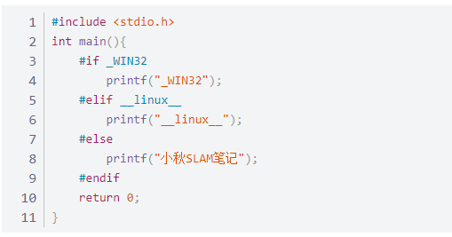

### 程序的生成过程
1. 预处理
    主要处理头文件包含、宏定义、条件编译等
    ｃ＋＋预处理器什么都不会做，只是做一些文本替换，预处理不会检查任何语法，
2. 条件编译

这段代码在预处理的时候就根据平台进行裁剪，这种条件编译可以减少文件体积

3. Macro defination
   a. 通过使用#ifndef，如
   ```
   #ifndef _CODE_BLOCK
   #define _C
